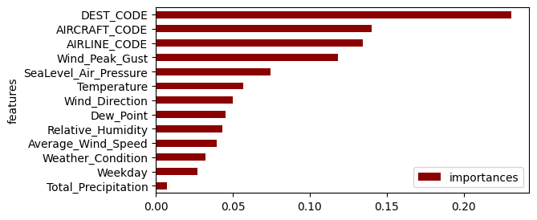

# AI-Applications-ZRH-Flightdelay
Project 1 for w.3KIA  

## Project Description
ZRH Flight Delay Prediction is a End-to-End Machine Learning application that estimates flight delays at Zurich Airport (ZRH) based on weather forecasts and flight informations.

## Results

The final model, deployed via Hugging Face, is a random forest regressor trained on a refined dataset. After testing multiple iterations, it became clear that the model tends to overfit. Although 7,487 samples were collected, they span only a three-week period and cover 265 different destinations. After removing outliers, this results in relatively few data points per destination, which limits the model’s generalization. Additionally, no distinction is made between airports with the same city designation (e.g., multiple airports in London using different IATA codes), which could impact accuracy. Despite these constraints, the model performs reasonably well given the available data, and future improvements could include extending the data collection period and refining destination encoding.

### Name & URL
| Name          | URL |
|--------------|----|
| Huggingface  | [Huggingface Space](https://huggingface.co/spaces/kaisest1/ZRH-Flight-Delay) |
| Code         | [GitHub Repository](https://github.com/kaisest1/AI-Applications-ZRH-Flightdelay) |

## Data Sources and Features Used Per Source
Obtaining flight data from Zurich Airport proved to be very difficult. A large, publicly accessible dataset was not available. As a workaround, I used web scraping on Flightradar to retrieve flight data from the previous day. This approach allowed me to collect flight data for Zurich Airport covering the period from April 28, 2025, to May 18, 2025. Weather data, on the other hand, was easily accessible via MeteoStat for the weather station located in Zurich-Kloten.
| Data Source | Features |
|-------------|----------|
| [Flightradar24](https://www.flightradar24.com) | Time, Flight, Destination, Airline, Aircraft, Status |
| [Meteostat](https://meteostat.net/de/station/06670) | time, temp (Air Temperature), dwpt (Dew Point), rhum (Relative Humidity), prcp (Total Precipitation), snow (Snow Depth), wdir (Wind Direction), wspd (Average Wind Speed), wpgt (Wind Peak Gust), pres (Sea-Level Air Pressure), tsun (Total Sunshine Duration), coco (Weather Condition Code) |

### Weather Condition Codes
Source: [Meteostat Developers](https://dev.meteostat.net/formats.html#time-format)
| Code | Weather Condition         |
|------|---------------------------|
| 1    | Clear                    |
| 2    | Fair                     |
| 3    | Cloudy                   |
| 4    | Overcast                 |
| 5    | Fog                      |
| 6    | Freezing Fog             |
| 7    | Light Rain               |
| 8    | Rain                     |
| 9    | Heavy Rain               |
| 10   | Freezing Rain            |
| 11   | Heavy Freezing Rain      |
| 12   | Sleet                    |
| 13   | Heavy Sleet              |
| 14   | Light Snowfall           |
| 15   | Snowfall                 |
| 16   | Heavy Snowfall           |
| 17   | Rain Shower              |
| 18   | Heavy Rain Shower        |
| 19   | Sleet Shower             |
| 20   | Heavy Sleet Shower       |
| 21   | Snow Shower              |
| 22   | Heavy Snow Shower        |
| 23   | Lightning                |
| 24   | Hail                     |
| 25   | Thunderstorm             |
| 26   | Heavy Thunderstorm       |
| 27   | Storm                    |

## Features Created
| Feature | Description |
|---------|-------------|
| DATETIME | The DATETIME feature was created because the actual departure date was missing during web scraping. It is a combination of the scheduled departure time and the corresponding date, ensuring each flight entry is accurately timestamped. |
| DESTINATION, IATA_CODE (not Used) | During web scraping, the destination information was retrieved in the format: Palma de Mallorca (PMI)-. Using regular expressions, I extracted both the destination name and the IATA code from this string. These values were then stored in the fields DESTINATION and IATA_CODE. |
| AIRLINE | The scraped airline information appeared in formats like: Edelweiss Air (Help Alliance Livery) -. Using regular expressions, the actual airline name was extracted and stored in the AIRLINE field. |
| AIRCRAFT | The aircraft information was provided in formats such as: A320 (HB-JLT). Using regular expressions, the aircraft type (e.g., A320) was extracted and stored in the AIRCRAFT field. |
| CANCELED (not Used) |Das Feld CANCELED ist ein boolescher Indikator, bei dem geprüft wird, ob der Flugstatus das Wort „Canceled“ enthält. Wenn der Flug in Flightradar als storniert markiert wurde, wird dieses Feld auf True gesetzt, ansonsten auf False.| 
| DEPART_TIME, DEPART_DATETIME | The DEPART_TIME field extracts the actual departure time (in HH:MM format) from the scraped STATUS string, if available. It is only extractet when the status includes a pattern like "Departed 09:31". The DEPART_DATETIME field combines the extracted departure time (DEPART_TIME) with the known date of scraping to reconstruct the full timestamp of departure. |
| DELAY, DELAY_MINUTES | The DELAY field represents the time difference between a flight’s scheduled departure (DATETIME) and its actual departure time (DEPART_DATETIME). This value is calculated by subtracting the scheduled time from the actual time. To make this delay more interpretable, the DELAY_MINUTES field was created, which converts the time difference into an integer representing the total number of minutes delayed. This transformation allows for easier analysis and comparison of flight delays.|
| DATETIME_HOUR | To enable a time-based merge with external weather data, the DATETIME_HOUR field was created by rounding the original DATETIME timestamp to the nearest full hour (e.g. 14:37 → 14:00). This conversion ensures synchronization with the hourly weather records. |
| DEST_CODE, AIRLINE_CODE, AIRCRAFT_CODE |  The fields DESTINATION, AIRLINE, and AIRCRAFT were each converted into numeric codes to make them usable for machine learning. These codes represent each unique value as an integer.   |
| Weekday (not Used)| As an attempt to improve performance, the feature Weekday was created. The idea was that delays might consistently occur on certain days of the week. However, the importance of the Weekday feature turned out to be low, so I decided not to include it in my final model. |

## Model Training

### Amount of Data
- Total of 7'558 flight records collected for Zurich Airport (ZRH)
- Total of 7'487 flight records after removing outliners

### Data Splitting Method (Train/Validation/Test)
- First, a classic 80/20 train/test split was performed to evaluate initial models. Subsequently, 5-fold cross-validation was used to obtain more robust performance metrics and to better assess model generality.

### Performance

The initial models were trained using all available features, but both linear regression and random forest showed weak generalization. To improve performance, I refined the dataset by removing outliers (delays < 0 set to 0, values > 120 minutes removed) and added the Weekday feature, which had minimal impact. After analyzing feature importance, I retrained the models using only the top 7 features. While random forest continued to overfit, linear regression remained weak—partly due to the use of integer encoding for categorical variables like airline, aircraft, and destination, which is not ideal for linear models. So i selected the Random Forrest Modell to deploy it on huggingface.

| It. Nr | Model | Performance | Features | Description |
|--------|--------|-------------|------------|---------------|
| 1 | Linear Regression | Train: 0.073, Test: 0.072,  Train RMSE: 22.4,  Test RMSE: 21.4 | `DEST_CODE, AIRLINE_CODE, AIRCRAFT_CODE, Weather_Condition, Temperature, Dew_Point, Relative_Humidity,Total_Precipitation, Wind_Direction, Average_Wind_Speed, Wind_Peak_Gust, SeaLevel_Air_Pressure` | Weak Model, Not Under or Overfitting |
| 2 | Random Forest | Train: 0.882, Test: 0.101,  Train RMSE: 8,  Test RMSE: 21 | Same as It. 1 | Overfitting |
| 3 | Linear Regression | Train: 0.084, Test: 0.066,  Train RMSE: 17,  Test RMSE: 18.3 | Same as It. 1 Removed Outliners: Value Delay minutes <0 set to 0 and removed Values over 120 min from the Dataset (see (#fig1 and #fig2))| Weak Model, Not Under or Overfitting |
| 4 | Random Forest | Train: 0.885, Test: 0.175,  Train RMSE: 6,  Test RMSE: 17.2 | Same as It. 3 | Overfitting |
| 5 | Linear Regression | Train: 0.091, Test: 0.074,  Train RMSE: 17,  Test RMSE: 18.2 | Added `Weekday` | Weak Model, Not Under or Overfitting |
| 6 | Random Forest | Train: 0.885, Test: 0.17,  Train RMSE: 6,  Test RMSE: 17.2 | Same as It. 5 | Overfitting |
| 7 | Linear Regression | Train: 0.075, Test: 0.058,  Train RMSE: 17.1,  Test RMSE: 18.3 | Reduced features after importance analysis   Still underfitting (see (#fig3 and #fig4))  `DEST_CODE, Wind_Peak_Gust,AIRLINE_CODE, AIRCRAFT_CODE, Wind_Direction, SeaLevel_Air_Pressure, Temperature` | Weak Model, Not Under or Overfitting |
| 8 | Random Forest | Cross-validation accuracy: -0.1019   Training accuracy: 0.8872 | Same as It. 7 |  |
| 9 | Random Forest | CV R² mean: 0.182 | Same as It. 7  | 
| 10 | Random Forest | Train: 0.886, Test: 0.169,  Train RMSE: 6,  Test RMSE: 17.2 | Same as It. 7 | Overfitting |

## References

### #Fig1 Distribution before

### #Fig2 Distribution after

### #Fig3 Importance analysis before

### #Fig4 Importance analysis after

